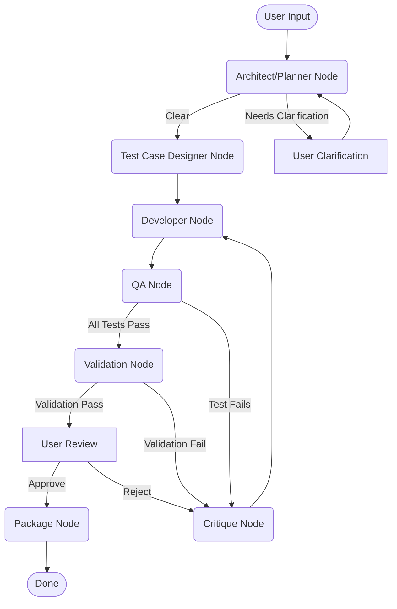

# Fábrica de Software Autónoma Simple (MVP)

Este proyecto demuestra un Producto Mínimo Viable (MVP) de una "Fábrica de Software Autónoma" utilizando PocketFlow para la orquestación de flujos de trabajo, Streamlit para una interfaz gráfica web y LLMs de OpenAI para diversas tareas impulsadas por IA en un ciclo de vida de desarrollo de software simplificado.

La aplicación permite al usuario describir una función de Python. Una serie de agentes de IA luego intentan:

1. Comprender y planificar la función.
2. Generar código Python.
3. Diseñar y ejecutar casos de prueba contra el código generado.
4. Validar el código contra reglas básicas.
5. Permitir al usuario revisar, aprobar o rechazar el código, proporcionando retroalimentación para su refinamiento.
6. Refinar iterativamente el código basándose en retroalimentación o en fallos de prueba/validación.
7. Empaquetar el código final aprobado.

## Características

* **Interfaz gráfica con Streamlit:** Interfaz web interactiva para entrada de usuario y retroalimentación.
* **Orquestación con PocketFlow:** Lógica principal del SDLC (planificación, codificación, pruebas, crítica, refinamiento) gestionada por nodos y flujos de PocketFlow.
* **Agentes de IA (potenciados por LLM):**
  * **Agente Arquitecto/Planificador:** Toma decisiones de alto nivel (Python/biblioteca estándar para el MVP) y refina las solicitudes del usuario en planes accionables o formula preguntas aclaratorias.
  * **Agente Desarrollador:** Genera y refina el código Python basándose en planes y retroalimentación.
  * **Agente Diseñador de Casos de Prueba:** Crea casos de prueba básicos para la función planificada.
  * **Agente QA:** Ejecuta los casos de prueba generados contra el código utilizando una `code_tester_tool`.
  * **Agente de Validación:** Verifica el código contra los estándares básicos del proyecto.
  * **Agente de Crítica:** Proporciona retroalimentación al Agente Desarrollador si las pruebas o la validación fallan, o si el usuario rechaza el código.
  * **Agente de Seguridad/Cumplimiento:** Verifica problemas básicos de seguridad y cumplimiento.
* **Humano en el Bucle (HITL):**
  * Especificación inicial de requisitos.
  * Respuestas de aclaración si el planificador de IA no está seguro.
  * Revisión, aprobación o rechazo (con retroalimentación) del código generado.
* **Refinamiento Iterativo:** El sistema puede iterar entre la crítica y la regeneración del código hasta un número configurable de veces.
* **Contexto RAG:** RAG basado en archivos simple para proporcionar pautas a los agentes (arquitectónicas, de planificación, codificación, validación, depuración, seguridad).
* **Persistencia con SQLite:** El progreso de la tarea, el código generado, los resultados de las pruebas y la retroalimentación se almacenan en una base de datos SQLite.
* **Contenedorizado con Docker:** La aplicación está contenedorizada para una configuración fácil y una ejecución consistente.

## Diagrama de Flujo del SDLC



## Estructura de Directorios

```text
pocketflow_sft_dev_app/
├── app.py                     # Streamlit UI and main logic
├── nodes.py                   # PocketFlow Node definitions
├── flow.py                    # PocketFlow Flow definitions
├── utils/
│   ├── __init__.py
│   ├── call_llm.py
│   ├── tools.py
│   ├── prompts.py
│   └── database.py
├── rag_contexts/              # Text files for RAG
│   ├── architectural_principles.txt
│   # ... (other .txt files)
├── database/                  # SQLite database will be created here
│   └── (sdlc_tasks.db)        # (created at runtime if not volume-mapped)
├── output_artifacts/          # (Optional) For saving final packaged code
├── Dockerfile
├── requirements.txt
└── README.md                  # This file
```

## Configuración y Ejecución con Docker Compose

1. **Prerrequisitos:**
    * Docker y Docker Compose instalados y en ejecución.
    * Una clave de API de OpenAI.

2. **Clona/Descarga los Archivos:**
    Asegúrate de que todos los archivos del proyecto estén en un directorio (por ejemplo, `autonomous-software-factory-design`).

3. **Configura los Secretos:**
    Crea un archivo `.env` en la raíz del proyecto con tus secretos (no comitees este archivo):

    ```env
    OPENAI_API_KEY=sk-your_actual_openai_api_key
    # You can add other environment variables here if needed
    ```

4. **Compila e Inicia la Aplicación:**
    Desde la raíz del proyecto, ejecuta:

    ```bash
    docker compose up --build
    ```

    Esto utilizará el `docker-compose.yml` y el `Dockerfile` proporcionados para compilar y ejecutar la aplicación. Tu código se montará en el contenedor para recargar en vivo durante el desarrollo.

5. **Persiste la Base de Datos SQLite (Predeterminado):**
    La base de datos se almacena en el directorio `database/` y se persiste de forma predeterminada mediante el mapeo de volúmenes en `docker-compose.yml`.

6. **Accede a la Aplicación:**
    Abre tu navegador web y navega a `http://localhost:8501`.

## Variables de Entorno

Las variables de entorno se pueden configurar en tu archivo `.env` o sobrescribir en `docker-compose.yml`:

* `OPENAI_API_KEY` (Requerido): Tu clave de API de OpenAI.
* `ARCHITECT_LLM_MODEL` (Predeterminado: `gpt-4o`): Modelo para el Arquitecto/Planificador.
* `PLANNER_LLM_MODEL` (Predeterminado: `gpt-4o`): Modelo para el Planificador.
* `DEVELOPER_LLM_MODEL` (Predeterminado: `gpt-3.5-turbo`): Modelo para el Desarrollador.
* `TEST_DESIGNER_LLM_MODEL` (Predeterminado: `gpt-3.5-turbo`): Modelo para el Diseñador de Casos de Prueba.
* `QA_LLM_MODEL` (Predeterminado: `gpt-4o`): Modelo para el Agente QA (uso de herramientas).
* `VALIDATION_LLM_MODEL` (Predeterminado: `gpt-3.5-turbo`): Modelo para el Agente de Validación.
* `CRITIQUE_LLM_MODEL` (Predeterminado: `gpt-4o-mini`): Modelo para el Agente de Crítica.
* `MAX_PLANNER_ITERATIONS` (Predeterminado: `2`): Máximo número de veces que el planificador pedirá aclaración.
* `MAX_REFINEMENTS` (Predeterminado: `3`): Máximo número de veces que el desarrollador refinará el código tras un rechazo/fallo.

## Cómo Funciona (Nivel Alto)

La aplicación utiliza Streamlit para gestionar diferentes etapas de la interfaz de usuario. Cada etapa podría activar un `Flow` de PocketFlow compuesto por varios `Node`s.

1. **Entrada de Requisitos:** El usuario proporciona una descripción.
2. **Planificación:** `ArchitectPlannerNode` procesa la solicitud. Si es clara, crea un plan. Si es ambigua, genera preguntas de aclaración.
3. **Aclaración (HITL):** Si se generan preguntas, la interfaz de usuario solicita la respuesta al usuario. La solicitud refinada se reintegra al `ArchitectPlannerNode`. Este ciclo continúa hasta que el plan es claro o se alcanza al máximo de iteraciones.
4. **Diseño de Pruebas y Generación de Código:** Una vez listo el plan, `TestCaseDesignerNode` genera casos de prueba. Luego, `DeveloperNode` genera el código Python inicial.
5. **Pruebas y Validación Automatizadas:** `QANode` ejecuta cada caso de prueba utilizando `code_tester_tool`. `ValidationNode` verifica el código contra reglas predefinidas. `SecurityComplianceNode` verifica problemas de seguridad/cumplimiento.
6. **Revisión Humana (HITL):** Se presenta al usuario el código generado, los resultados de las pruebas y la retroalimentación de validación.
    * **Aprobar:** La tarea avanza hacia la finalización.
    * **Rechazar:** El usuario proporciona retroalimentación.
7. **Crítica y Refinamiento:** Si se rechaza (o si las pruebas/validación fallan), `CritiqueNode` analiza los problemas y la retroalimentación del usuario. Luego, `DeveloperNode` intenta refinar el código. Este ciclo (vuelve al paso 5) continúa hasta que se apruebe o se alcance el máximo de refinamientos.
8. **Empaquetado/Finalización:** Si se aprueba, `PackageNode` prepara la salida final. Si se alcanza el máximo de refinamientos/iteraciones de planificación, el proceso finaliza con un mensaje de fallo.

SQLite se utiliza para almacenar el estado de cada tarea, incluidos todos los artefactos generados y la retroalimentación, lo que permite la persistencia.

## Solución de Problemas: Errores de Importación en Docker/Streamlit

Si ves errores como `KeyError: 'utils'` o `KeyError: 'nodes'` en los registros de Docker:

* Asegúrate de que todas las importaciones en tu código sean absolutas (p. ej., `from utils.prompts import ...` y no importaciones relativas).
* Añade `ENV PYTHONPATH=/app` a tu Dockerfile (suponiendo que tu código está en `/app` dentro del contenedor).
* Asegúrate de ejecutar Streamlit desde la raíz del proyecto (`WORKDIR /app`).
* Vuelve a compilar tu imagen de Docker después de realizar estos cambios.

**Mejor práctica del Dockerfile para problemas de importación en Streamlit:**

Añade esto para asegurar que las importaciones absolutas funcionen en Docker/Streamlit:

```dockerfile
ENV PYTHONPATH=/app
```

Y asegúrate de que tu Dockerfile tenga:

```dockerfile
WORKDIR /app
CMD ["streamlit", "run", "app.py", "--server.address=0.0.0.0", "--server.runOnSave=true"]
```

Si ves `KeyError: 'utils'` o `KeyError: 'nodes'`, esto casi siempre es un problema de ruta de importación/módulo de Python en Docker.

## Mejoras Futuras

* RAG más sofisticado utilizando LlamaIndex o similar.
* Soporte para software más complejo (múltiples archivos, clases, dependencias).
* Verificaciones avanzadas de seguridad (SAST/DAST) y cumplimiento.
* Gráfico visual de la ejecución de PocketFlow en Streamlit.
* Capacidad para cargar y reanudar tareas anteriores.
