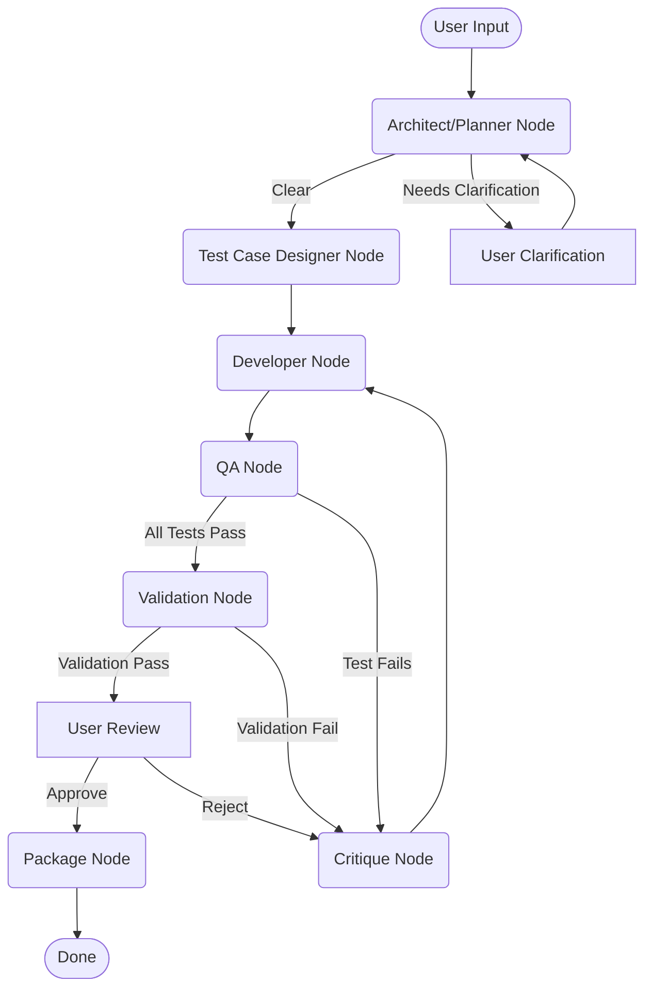

# Simple Autonomous Software Factory (MVP)

This project demonstrates a Minimum Viable Product (MVP) of an "Autonomous Software Factory" using PocketFlow for workflow orchestration, Streamlit for a web-based GUI, and OpenAI LLMs for various AI-driven tasks in a simplified software development lifecycle.

The application allows a user to describe a Python function. A series of AI agents then attempt to:

1. Understand and plan the function.
2. Generate Python code.
3. Design and execute test cases against the generated code.
4. Validate the code against basic rules.
5. Allow the user to review, approve, or reject the code, providing feedback for refinement.
6. Iteratively refine the code based on feedback or test/validation failures.
7. Package the final approved code.

## Features

* **Streamlit GUI:** Interactive web interface for user input and feedback.
* **PocketFlow Orchestration:** Core SDLC logic (planning, coding, testing, critique, refinement) managed by PocketFlow nodes and flows.
* **AI Agents (LLM-Powered):**
  * **Architect/Planner Agent:** Makes high-level decisions (Python/standard lib for MVP) and refines user requests into actionable plans or asks clarifying questions.
  * **Developer Agent:** Generates and refines Python code based on plans and feedback.
  * **Test Case Designer Agent:** Creates basic test cases for the planned function.
  * **QA Agent:** Executes generated test cases against the code using a `code_tester_tool`.
  * **Validation Agent:** Checks code against basic project standards.
  * **Critique Agent:** Provides feedback to the Developer Agent if tests or validation fail, or if the user rejects the code.
* **Human-in-the-Loop (HITL):**
  * Initial requirement specification.
  * Clarification responses if the AI planner is unsure.
  * Review, approval, or rejection (with feedback) of generated code.
* **Iterative Refinement:** The system can loop through critique and code regeneration up to a configurable number of times.
* **RAG Context:** Simple file-based RAG for providing guidelines to agents (architectural, planning, coding, validation, debugging).
* **SQLite Persistence:** Task progress, generated code, test results, and feedback are stored in an SQLite database.
* **Dockerized:** The application is containerized for easy setup and consistent execution.

## SDLC Flow Diagram



## Directory Structure

```text
pocketflow_sft_dev_app/
├── app.py                     # Streamlit UI and main logic
├── nodes.py                   # PocketFlow Node definitions
├── flow.py                    # PocketFlow Flow definitions
├── utils/
│   ├── __init__.py
│   ├── call_llm.py
│   ├── tools.py
│   ├── prompts.py
│   └── database.py
├── rag_contexts/              # Text files for RAG
│   ├── architectural_principles.txt
│   # ... (other .txt files)
├── database/                  # SQLite database will be created here
│   └── (sdlc_tasks.db)        # (created at runtime if not volume-mapped)
├── output_artifacts/          # (Optional) For saving final packaged code
├── Dockerfile
├── requirements.txt
└── README md                  # This file
```

## Setup & Running with Docker Compose

1. **Prerequisites:**
    * Docker and Docker Compose installed and running.
    * An OpenAI API key.

2. **Clone/Download Files:**
    Ensure all project files are in a directory (e.g., `autonomous-software-factory-design`).

3. **Configure Secrets:**
    Create a `.env` file in the project root with your secrets (do not commit this file):

    ```env
    OPENAI_API_KEY=sk-your_actual_openai_api_key
    # You can add other environment variables here if needed
    ```

4. **Build and Start the Application:**
    From the project root, run:

    ```bash
    docker compose up --build
    ```

    This will use the provided `docker-compose.yml` and `Dockerfile` to build and run the app. Your code will be mounted into the container for live reload during development.

5. **Persist the SQLite Database (Default):**
    The database is stored in the `database/` directory and is persisted by default via the volume mapping in `docker-compose.yml`.

6. **Access the Application:**
    Open your web browser and navigate to `http://localhost:8501`.

## Environment Variables

Environment variables can be set in your `.env` file or overridden in `docker-compose.yml`:

* `OPENAI_API_KEY` (Required): Your OpenAI API key.
* `ARCHITECT_LLM_MODEL` (Default: `gpt-4o`): Model for the Architect/Planner.
* `PLANNER_LLM_MODEL` (Default: `gpt-4o`): Model for the Planner.
* `DEVELOPER_LLM_MODEL` (Default: `gpt-3.5-turbo`): Model for the Developer.
* `TEST_DESIGNER_LLM_MODEL` (Default: `gpt-3.5-turbo`): Model for the Test Case Designer.
* `QA_LLM_MODEL` (Default: `gpt-4o`): Model for the QA Agent (tool use).
* `VALIDATION_LLM_MODEL` (Default: `gpt-3.5-turbo`): Model for the Validation Agent.
* `CRITIQUE_LLM_MODEL` (Default: `gpt-4o-mini`): Model for the Critique Agent.
* `MAX_PLANNER_ITERATIONS` (Default: `2`): Max times planner will ask for clarification.
* `MAX_REFINEMENTS` (Default: `3`): Max times developer will refine code after rejection/failures.

## How It Works (High-Level)

The application uses Streamlit to manage different UI stages. Each stage might trigger a PocketFlow `Flow` composed of several `Node`s.

1. **Input Requirements:** User provides a description.
2. **Planning:** `ArchitectPlannerNode` processes the request. If clear, it creates a plan. If ambiguous, it generates clarification questions.
3. **Clarification (HITL):** If questions are generated, the UI prompts the user. The refined request is fed back to the `ArchitectPlannerNode`. This loop continues until the plan is clear or max iterations are hit.
4. **Test Design & Code Generation:** Once a plan is ready, `TestCaseDesignerNode` generates test cases. Then, `DeveloperNode` generates the initial Python code.
5. **Automated Testing & Validation:** `QANode` executes each test case using `code_tester_tool`. `ValidationNode` checks the code against predefined rules.
6. **Human Review (HITL):** The generated code, test results, and validation feedback are presented to the user.
    * **Approve:** The task moves to completion.
    * **Reject:** The user provides feedback.
7. **Critique & Refinement:** If rejected (or if tests/validation failed), `CritiqueNode` analyzes the issues and user feedback. The `DeveloperNode` then attempts to refine the code. This loop (back to step 5) continues until approval or max refinements.
8. **Packaging/Completion:** If approved, `PackageNode` prepares final output. If max refinements/planning iterations are hit, the process ends with a failure message.

SQLite is used to store the state of each task, including all generated artifacts and feedback, allowing for persistence.

## Future Enhancements

* More sophisticated RAG using LlamaIndex or similar.
* Support for more complex software (multiple files, classes, dependencies).
* Advanced security (SAST/DAST) and compliance checks.
* Visual graph of the PocketFlow execution in Streamlit.
* Ability to load and resume previous tasks.
